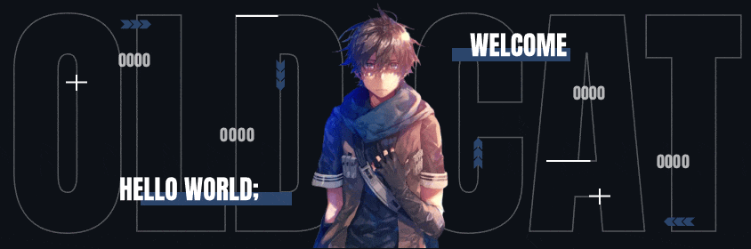
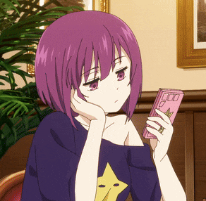
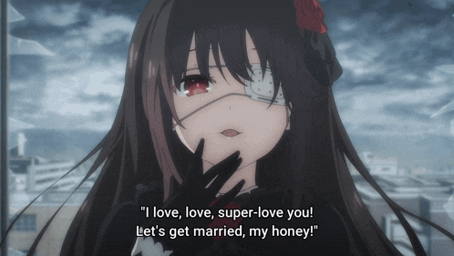

<p align="center">
  
</p>

<a href="https://t.me/Therazerhub"></a>

<div align="center">
  
</div>

<h1 align="center">~ 💖 𝓦𝓮𝓵𝓬𝓸𝓶𝓮 𝓽𝓸 𝓶𝔂 𝓟𝓻𝓸𝓯𝓲𝓵𝓮 💖 ~</h1>
<h3 align="center"><i>1AM CODER • BOT WRANGLER • TERMINAL ENJOYER</i></h3>

<p align="center">
  
  <a href="https://github.com/Therazerhub"></a>
</p>

<br>

## 🦊 ~ 𝓐𝓫𝓸𝓾𝓽 𝓶𝓮 ~ 🦊



```csharp
therazerhub@github
-------------------------
Username: Vaibhav Vijay Bhavre 🖤
WhoAmI: Bot wrangler. Terminal enthusiast. 1AM coder.
Location: India 🇮🇳
Languages: Python, C++, TypeScript, JavaScript
Fav.Anime: anything with good waifus ✩
Waifu: Marin Kitagawa 💘
Pronouns: He/Him
Hobbies: Building bots, terminal UIs, anime, music
Status: employed? no. happy? absolutely
```

<br clear="left"/>

<br>

## 🛠️ ~ 𝓣𝓮𝓬𝓱 𝓢𝓽𝓪𝓬𝓴 ~ 🛠️

### 💻 Programming Languages

<p align="center">
  
</p>

### ⚙️ Frameworks & Libraries

<p align="center">
  
</p>

### 🗄️ Database & Cloud

<p align="center">
  
</p>

### 🧰 Tools

<p align="center">
  
</p>

<br>

## 📦 ~ 𝓟𝓻𝓸𝓳𝓮𝓬𝓽𝓼 ~ 📦

| Project | What it is | Tech |
|---------|-----------|------|
| 🩺 **Diabetes Predictor** | ML web app — SVM heart-disease risk | [](https://github.com/Therazerhub/diabetes) |
| 🐈 **CatMoeBot** | Telegram bot — upload files to Catbox.moe | [](https://github.com/Therazerhub/CatMoeBot) |
| 🧠 **Portfolio** | Single-page portfolio site | [](https://github.com/Therazerhub/portfolio) |

<br>

## 📊 ~ 𝓖𝓲𝓽𝓱𝓾𝓫 𝓢𝓽𝓪𝓽𝓼 ~ 📊

<p align="center">
  
  
</p>

<p align="center">
  
</p>

<p align="center">
  
</p>

## 🏆 ~ 𝓣𝓻𝓸𝓹𝓱𝓲𝓮𝓼 ~ 🏆

<p align="center">
  
</p>

<br>

## 🎭 ~ 𝓓𝓮𝓿 𝓛𝓲𝓯𝓮 ~ 🎭

<p align="center">
  
</p>

<p align="center">
  
</p>

<br>

## 📫 ~ 𝓒𝓸𝓷𝓽𝓪𝓬𝓽 ~ 📫



**Please Contact me on Telegram for a quick response:** [@therazerhub](https://t.me/Therazerhub)

**You can also email me here:** Therazerhub@gmail.com

<a href="https://instagram.com/therazerhub"></a>
<a href="https://youtube.com/@therazerhub"></a>
<a href="https://t.me/Therazerhub"></a>
<a href="mailto:Therazerhub@gmail.com"></a>

<br clear="right"/>

<br>

<p align="center">
  
</p>

---

<p align="center">
  <sub>made with 🖤 by therazerhub — pull requests welcome, sleep optional</sub>
</p>
